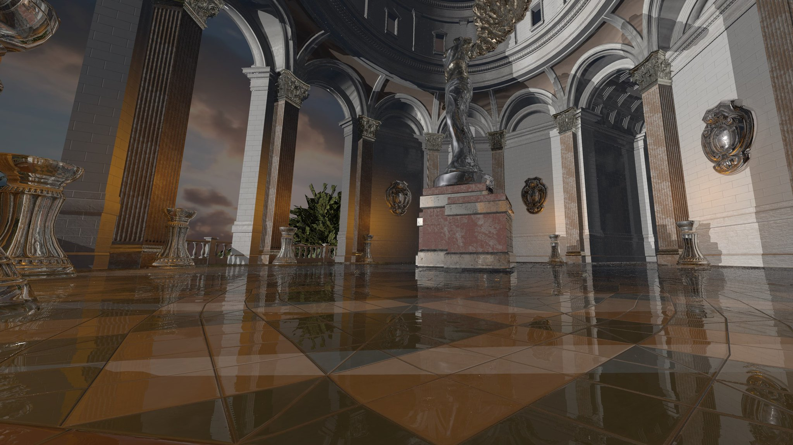
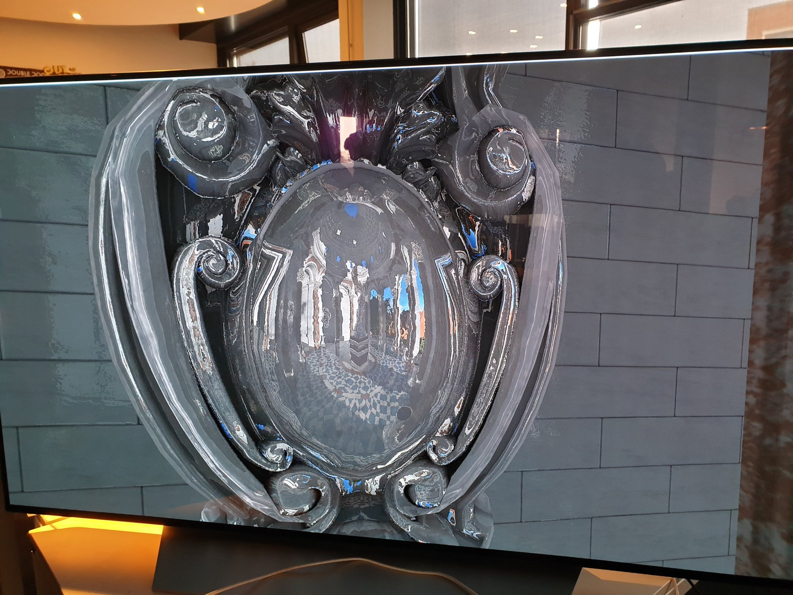
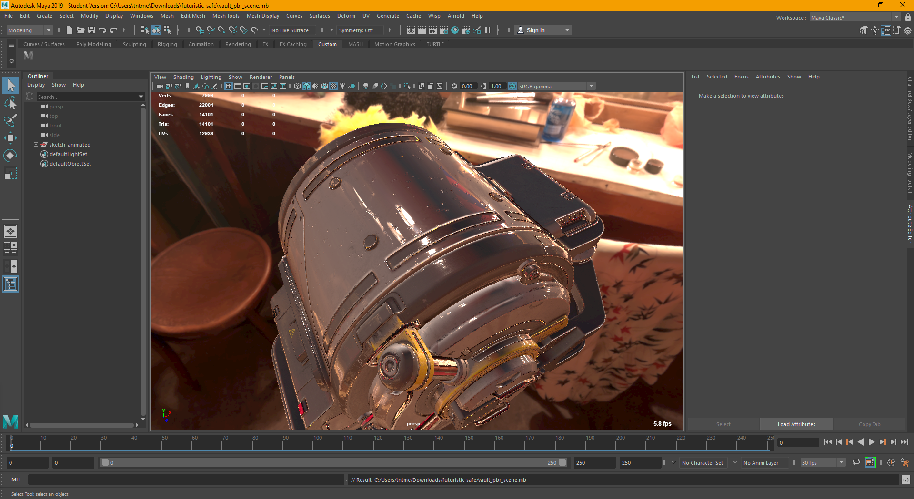
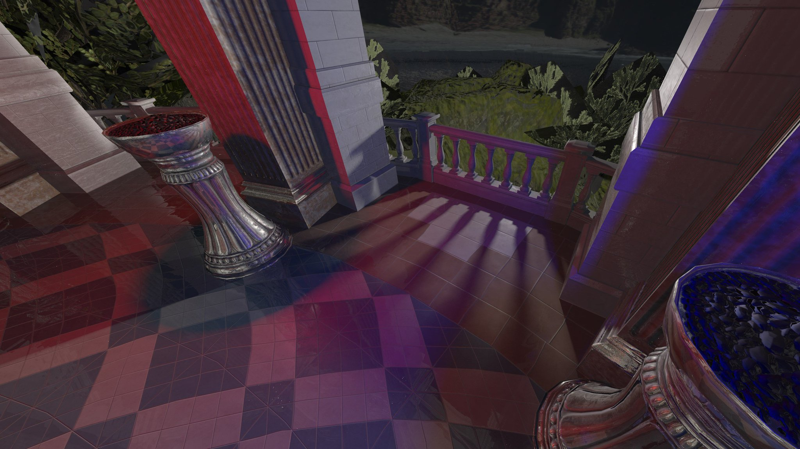

# Wisp Rendering Framework
We are a group of students from [Breda University of Applied Sciences]([https://www.buas.nl](https://www.buas.nl/)) working on a rendering framework using cutting-edge real-time ray-tracing technology from NVIDIA.

## Table of contents

- [Showcase](#showcase)

- [Product overview](#product-overview)
- [Features](#features)
- [Contributing](#contributing)
  - [Setting up your workspace](#setting-up-your-workspace)
  - [Development pipeline](#development-pipeline)
  - [Coding standards](#coding-standards)
  - [Documentation standards](#documentation-standards)
  - [Code architecture](#code-architecture)
- [More information](#more-information)

## Showcase

|                      |  |
| --------------------------------------------- | ------------------------------------------------- |
|  |             |

## Product overview

Wisp is an advanced real-time ray tracing renderer built for the demands of video game artists. Wisp integrates with [Maya](https://www.autodesk.com/products/maya/overview) to give the user a real-time in-viewport representation of the final product. The goal of this project is to eliminate long render times during modelling by giving artists a real-time high quality render of the scene in the viewport.

## Features

You can find a more detailed list [here](http://teamwisp.github.io/feature_list) which also separates the tasks into critical and non-critical.

- Global Illumination.
- Ambient Occlusion.
- Reflections.
- Shadows.
- Physically Based Rendering.
- Translucent & Transparency.
- GPU Accelerated.
- Realtime rendering.
- Built for NVIDIA RTX.
- Implemented into Maya/Blender’s viewport.
- Dynamic LOD’s for non-selected / background objects.

## Contributing

### Setting up your workspace

#### Prerequisites

- Git
- Windows 10 (1803 or higher)
- Visual Studio 15.9
- CMake 3.12.4 or higher
- Windows SDK 10.0.17763.0
- Maya 2018
- Feature Level 12.1 Capable Hardware
- [Static Code Analyzer](http://teamwisp.github.io/code_standards/#automated-code-analysis) *(or MSVC’s /analyze)*

#### Installation

1. Open CMD or PowerShell in the installation directory of your choice.
2. `git clone https://github.com/TeamWisp/Procedural-Ray-Tracing.git` (Clones the repository in a folder named Procedural-Ray-Tracing. To specify a different directory add a space to the end of the command followed by your preferred path).
3. Run `install.bat`.
4. The project files are located in `build_[compiler]_[platform]`.

#### Optional

To create a feature branch call `git checkout -b feature_[yourfeaturename]`.

#### Troubleshooting

- **Visual Studio doesn’t detect new files** - Automatic refreshing might not work for some people. Run the `reload.sh` file than Visual Studio will prompt you to reload the solution.
- **Visual Studio places new files in the wrong place** - Just create them manually from the file explorer.

### Development pipeline

#### New code / major bug fixes / refactoring

1. **Create a new branch**
   1. Update **development** and/or **feature** branches to the latest version.
   2. Create Branch.
      - Feature branches are prefixed with `feature_`.
      - Short and descriptive naming.
2. **Make changes**
   1. Make Changes.
   2. Test.
      - Make and/or run unit tests.
   3. Commit
      - Prefix the message with: `[CHANGE]`, `[FIX]` or `[WIP]`.
      - Split your work into small parts. Every part is a commit. If the lead developer notices a lack of commits action will be taken.
3. **Push changes**
   1. Pull master for any changes.
   2. Rebase branch onto master.
   3. Squash any `[WIP]` commits.
      - Try to prevent submitting `[WIP]` commits to the feature branch.
   4. Refactor if necessary.
   5. Push changes / branch up to Github.
4. **Pull request**
   1. Open pull request into the `development` branch. ([Tutorial](https://help.github.com/articles/about-pull-requests/))
      - Describe changes in detail.
      - Add a bullet point changelog.
   2. The build server builds the pull request.
5. **Code review**
   1. Other developers should review code and leave suggestions. ([Tutorial](https://github.com/features/code-review/))
      - No overly complex or clever code.
      - Check for potential issues.
      - Architectural improvements.
      - Code is properly abstracted.
      - Consider potential tests.
   2. Code author is responsible for making any changes.
      - Commit process follows the same process.
   3. At least 2 reviewers should approve the code.
      - Leave a comment with an emoji thumbs up.
      - Briefly explain why it is okay.

#### Minor bug fixes

1. Update **development** and/or **feature** branches to the latest version.
2. Checkout your target branch.
3. Make Changes.
4. Commit Changes.
   - Prefix the message with: `[FIX]`.
5. Push Changes.

#### Miscellaneous

**Exceptional work**

Exceptional code will be show cased and discussed during a meeting to both reward the author and educate the other programmers.

**Broken builds**

When a build breaks there will be a public message in Discord noting who broke it. This is not to punish people but to ensure there is always some one who knows who to contact when the build is broken and or go to him/her to help fix it.

No action will be taken against people who brake the build. However if it becomes a regular occurrence for an individual this will change. Action would vary case by case and is performed by the lead programmer.

### Coding standards

This project follows the a modified version of the Lefticus coding standard available on [GitHub](https://gist.github.com/lefticus/10191322) and the [C++ Code Guidelines](https://github.com/isocpp/CppCoreGuidelines/blob/master/CppCoreGuidelines.md).

Please read this page thoroughly before starting on your feature: [https://teamwisp.github.io/code_standards/](https://teamwisp.github.io/code_standards/)

### Documentation standards

To keep the codebase clear and understandable for all developers, we came up with some rules regarding the documentation developers have to make when changing the codebase.

Please read this page thoroughly before making a pull request: [https://teamwisp.github.io/docs/](https://teamwisp.github.io/docs/)

### Code architecture

New contributors may find it a bit overwhelming to get started on a project of this size. This is why we have created a short introduction page on the Wiki that explains some of the basics of the framework: [https://teamwisp.github.io/architecture/](https://teamwisp.github.io/architecture/)

## More information

This README is only a summary of the most important things developers should know about the project. It is highly encouraged to have a look at our [Wiki](https://teamwisp.github.io/). It covers all topics mentioned above, and more...

If you made it this far, congratulations! We hope to see you soon in our development server: https://discordapp.com/invite/KthSUvs